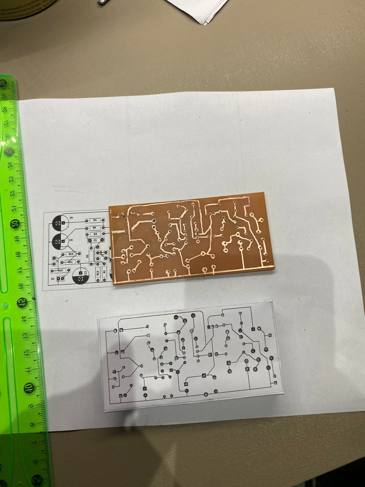
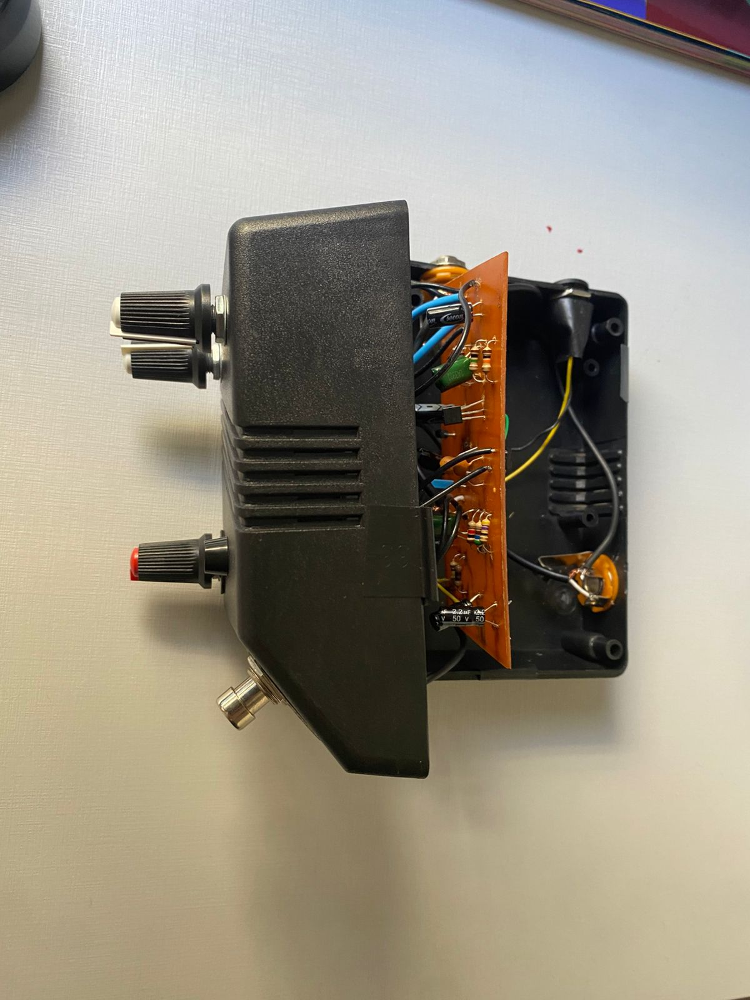

# Projeto de Hardware: Pedal de Distorção (Baseado no ProCo RAT)

Este projeto é uma versão personalizada do icônico pedal de distorção **ProCo RAT**. O desenvolvimento envolveu desde o estudo do esquemático até a fabricação física da placa de circuito impresso (PCB).

## Especificações Técnicas
* **Controles:** 
  * `Gain`: Controle da intensidade da distorção.
  * `Filter`: Ajuste de corte de frequências (característica única do RAT).
  * `Volume`: Controle do nível de saída.
* **Componentes:** Resistores, capacitores (eletrolíticos e cerâmicos), diodos de clipagem e o amplificador operacional (Amp-Op).
* **Fabricação:** Placa produzida via corrosão em percloreto de ferro (ácido) e furação manual.

## Status do Projeto
Os arquivos do **KiCad* estão sendo refinados para documentar a versão final. O protótipo físico já está montado, testado e funcional.

## Processo de Fabricação e Resultado Final

### Placa de Circuito (Corrosão e Furação)
Aqui está o detalhe da PCB após o banho de ácido e a furação, pronta para receber os componentes:

### Pedal Finalizado
O resultado final do pedal montado na caixa:

---
*Este projeto faz parte do meu portfólio de Engenharia da Computação.*